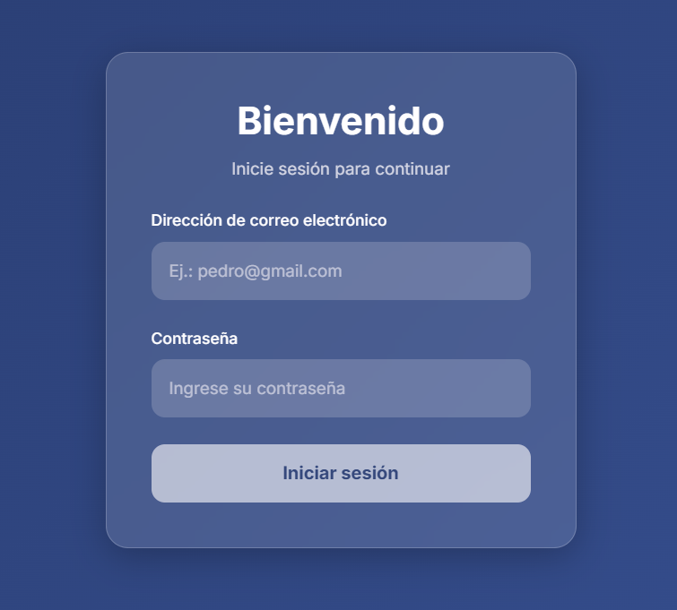
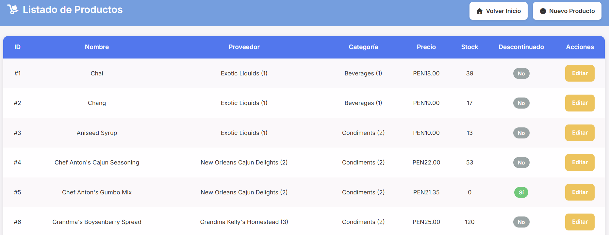
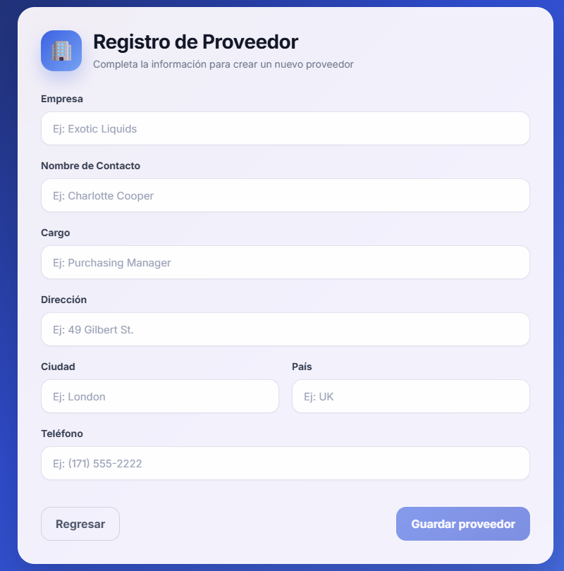

# Northwind Management System | Spring Boot + Angular

Full-stack web management system based on the Microsoft Northwind database, built with Spring Boot and Angular using a RESTful client-server architecture.

The project includes a REST API backend, a modern Angular frontend, and SQL Server integration for data persistence.

---

## Features

- Product management
- Category management
- Supplier management
- Employee management
- RESTful API integration
- Client-server architecture
- Reactive forms with Angular
- CRUD operations
- SQL Server persistence
- Layered backend architecture
- Component-based frontend structure

---

## Technologies

### Backend
- Java
- Spring Boot
- Spring Data JPA

### Frontend
- Angular
- TypeScript
- SCSS

### Database
- SQL Server
- Northwind Database

### Tools
- Git
- GitHub
- Postman

---

## Project Structure

```txt
northwind-web-spring-angular/
├── northwind-api/     # Spring Boot REST API
├── Northwind_app/     # Angular frontend application
└── database/          # SQL scripts
```

---

## Backend Architecture

The backend follows a layered architecture:

- Controllers
- Services
- Repositories
- Models

REST APIs were implemented to allow communication between the Angular frontend and the Spring Boot backend.

---

## Frontend

The Angular application includes:

- Modular routing
- Reactive forms
- CRUD interfaces
- API consumption using services
- Component-based architecture

---

## Database

The project uses the classic Microsoft Northwind database.

SQL script included in:

```txt
database/northwind.sql
```

### Database Configuration

Update the database credentials in:

```txt
northwind-api/src/main/resources/application.properties
```

Example:

```properties
spring.datasource.url=jdbc:sqlserver://localhost:1433;databaseName=Northwind;encrypt=true;trustServerCertificate=true
spring.datasource.username=sa
spring.datasource.password=your_password
pring.jpa.hibernate.naming.physical-strategy=org.hibernate.boot.model.naming.PhysicalNamingStrategyStandardImpl
spring.jpa.hibernate.ddl-auto=none
```

---

## Requirements

- Java 17+
- Node.js 18+
- Angular CLI
- SQL Server

---

## Screenshots

### Login



### Products List



### Supplier Form



---

## Getting Started

### Clone Repository

```bash
git clone https://github.com/chiletlab/northwind-web-spring-angular.git
```

---

### Backend Setup

```bash
cd northwind-api
mvn spring-boot:run
```

The backend will run on:

```txt
http://localhost:9090
```

---

### Frontend Setup

```bash
cd Northwind_app
npm install
ng serve
```

The frontend will run on:

```txt
http://localhost:4200
```

---

## API Testing

You can test the REST API using:

- Postman
- Thunder Client
- Insomnia

---

## Academic Purpose

This project was developed for educational purposes as part of software development training.